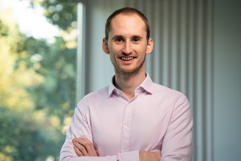

Welcome to my website! My name is Ben. I'm a [Senior Research Scholar](https://www.fhi.ox.ac.uk/team/ben-snodin/) at the [Future of Humanity Institute](https://www.fhi.ox.ac.uk/), where my work focuses on the risks and opportunities from a potential future technology called atomically precise manufacturing.

I previously worked in finance as a quantitative analyst, and before then I completed a [PhD in DNA nanotechnology](https://dna.physics.ox.ac.uk/index.php/Main_Page) at Oxford University. I also used to row a lot.

I'm into [effective altruism](https://www.effectivealtruism.org/) and [longtermism](https://www.effectivealtruism.org/articles/cause-profile-long-run-future/), and I've signed the [Giving What We Can](https://www.givingwhatwecan.org/) pledge.
